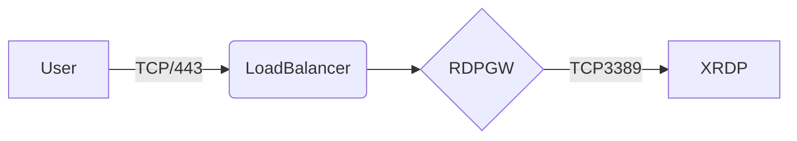

# RDPGW

## Brief

RDPGW is an util which implementation Microsoft Remote Desktop Gateway Protocol written on GO.
The util can run on Linux OS.

Let's say, entrypoint is 443 port to reach our infrastructure. How we can reach RDP service from outside?
The answer is a RDP reverse-proxy.

Scheme:



Tips:
* Authentication `local` means Linux OS already exists `sssd` service can get LDAP users
* `XRDP` uses `sssd` for verify and auth users
* Build process reviewed detail in original [repo](https://github.com/bolkedebruin/rdpgw)
* Don't forget about certs
* Should be running two processes `rdpgw-auth` and `rdpgw`

## Config RDPGW

```yaml
# web server configuration. 
Server:
  Authentication:
   - local
  # The socket to connect to if using local auth. Ensure rdpgw auth is configured to
  # use the same socket.
  AuthSocket: /tmp/rdpgw-auth.sock
  # The default option 'auto' uses a certificate file if provided and found otherwise
  # it uses letsencrypt to obtain a certificate, the latter requires that the host is reachable
  # from letsencrypt servers. If TLS termination happens somewhere else (e.g. a load balancer)
  # set this option to 'disable'. This is mutually exclusive with 'authentication: local'
  # Note: rdp connections over a gateway require TLS
  Tls: auto
  # TLS certificate files
  CertFile: server.pem
  KeyFile: key.pem
  GatewayAddress: localhost:8443
  Port: 8443
  Hosts:
  - localhost:3389
  #HostSelection: false
  SessionKey: thisisasessionkeyreplacethisjetz
  SessionEncryptionKey: thisisasessionkeyreplacethisjetz
  SessionStore: cookie
Caps:
  TokenAuth: false
  # connection timeout in minutes, 0 is limitless
  IdleTimeout: 10
  EnablePrinter: true
  EnablePort: true
  EnablePnp: true
  EnableDrive: true
  EnableClipboard: true
Client:
  # this is a go string templated with {{ username }} and {{ token }}
  # the example below uses the ASCII field separator to distinguish
  # between user and token 
  UsernameTemplate: "{{ username }}"
  # rdp file settings see: 
  # https://docs.microsoft.com/en-us/windows-server/remote/remote-desktop-services/clients/rdp-files
  NetworkAutoDetect: 0
  BandwidthAutoDetect: 1
  ConnectionType: 6
  SplitUserDomain: false
```
