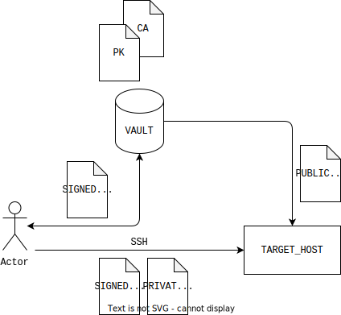

# SSH and signed keys by Vault

Hey there,

Today I would like to share a new topic regarding Vault as service for signed SSH keys.

## How it works

### Descriptions:
* Vault keeps certificates and signed user's public key and provide a temp key for auth on a target host.
* Target host has a predefined cert on `sshd_config`. The same cert should be deployed on Vault
* User needs sign public key before make ssh connect to the target host 

### Advantages:
* Easy access control who have to connect to the target host
* The target host might be exists a just one user
* User access limited by TTL by signed cert
* Vault can manage the additional SSH features as `port-forwarding` and etc

### Disadvantages:
* Vault as additional point of fail
* User have to use a different behavior, not like before with pure SSH connect
* Need care about rotation certs

## Scheme



## Configuration

Create the secret mount for SSH certs manage

```bash
$ vault secrets enable -path=ssh-sign ssh
```

Create a policy

```bash
$ vault policy write my-policy -<<"EOF"
path "ssh-sign/sign/ubuntu" {
  capabilities = ["create","update"]
}
EOF
```

Upload created and signed CA or Intermediate cert

```bash
$ vault write ssh-sign/config/ca \
    private_key=@cert.pem \
    public_key=@key.pem
```

Get `trusted-user-ca-keys.pem` then it need uploading to the target host

```bash
$ vault read -field=public_key ssh-sign/config/ca > /etc/ssh/trusted-user-ca-keys.pem
```

Update `sshd_config` on the target host

```bash
...
TrustedUserCAKeys /etc/ssh/trusted-user-ca-keys.pem
...
```

Create a `ubuntu` role

> "algorithm_signer": "rsa-sha2-512" Is it very important without option we have problem with auth to target host.

```bash
$ vault write ssh-sign/roles/ubuntu -<<"EOH"
{
  "allow_user_certificates": true,
  "algorithm_signer": "rsa-sha2-512",
  "allowed_users": "*",
  "allowed_extensions": "permit-pty,permit-port-forwarding",
  "default_extensions": [
    {
      "permit-pty": ""
    }
  ],
  "key_type": "ca",
  "default_user": "ubuntu",
  "ttl": "30m0s"
}
EOH
```

On client side we need generate the private and public keys

```bash
$ ssh-keygen -t rsa -C "user@domain.com"
```

Sign a public key by Vault

```bash
$ vault write ssh-sign/sign/ubuntu \
    public_key=@<path-to-your-id_rsa.pub>
```

Store a signed key on localhost

```bash
$ vault write -field=signed_key ssh-sign/sign/ubuntu \
    public_key=@<path-to-your-id_rsa.pub> > signed-cert.pub
```

Check connect to the target host
> We make sure you use two keys. One signed and other created before without it magic can't happend.

```
$ ssh -i signed-cert.pub -i ~/.ssh/id_rsa ubuntu@<TARGET_HOST>
```

## How does it check a signed cert

```bash
$ ssh-keygen -Lf ~/.ssh/signed-cert.pub
```

```bash
# An example output

signed-cert.pub:
        Type: ssh-rsa-cert-v01@openssh.com user certificate
        Public key: RSA-CERT SHA256:XXX
        Signing CA: RSA SHA256:XXX (using rsa-sha2-512)
        Key ID: "vault-ldap-user-xxx"
        Serial: 11111111111111111111
        Valid: from 2023-09-10T15:13:55 to 2023-09-10T15:44:25
        Principals: 
                ubuntu 
        Critical Options: (none)
        Extensions: 
                permit-pty
```
